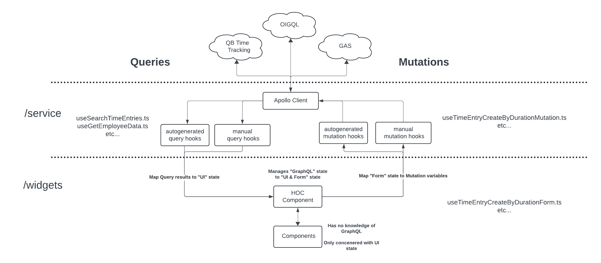
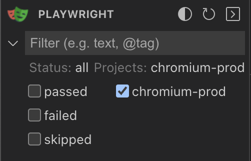

# [time-tracking-ui](https://devportal.intuit.com/app/dp/resource/8506191389517858617)

## 👋 Welcome!

`time-tracking-ui` runs the QB Time Tracking user experience on top of the
[qb-time-tracking](https://github.intuit.com/work-timecapture/qb-time-tracking)
service and QB ecosystem.

Right now this plugin is running in QB with the path `/app/qtime`

To run plugin against your locally running Time Tracking service, un-comment this line
in [ApolloBuilderUtils](https://github.intuit.com/work-timecapture/time-tracking-ui/blob/master/src/js/service/ApolloClientBuilderUtils.ts#L63). An alternate solution is to utilize the Intuit Developer Proxy.  Find a readme here: [dev-proxy.md](docs/dev-proxy.md)

Link to plugin
[owners](https://github.intuit.com/orgs/work-timecapture/people?utf8=%E2%9C%93&query=+role%3Aowner).

## 📦 Structure

- `/src`
  - `__generated__/` - auto generated hooks and types
  - `/js`
    - `/common` - common utils
    - `/service` - functionality for service calls
    - `/widgets` - components for UI/UX
      - `/timetrackingui` - main widget of time-tracking-ui
      - `/singleTimeTrowser` - trowser for single time create
      - `/weeklyTimeTrowser` - trowser for weekly time create
- `/codegen` - code generation
- `/test`
  - `/unit` - unit tests
  - `/automation` - automation tests
- `__mocks__/` - jest mocks
  - `__generated__/` - generated test data

## 🔩 Technologies Used

| Infra                  | Service            | Widgets           |
|------------------------|--------------------|-------------------|
| plugin-cli             | Apollo 3           | react-hook-form   |
| node                   | graphql-codegen    | @ids-ts & @qbds   |
| React                  | setting-service-ui | styled-components |
| Typescript             | ux-preferences-lib |                   |
| ESLint                 | dayjs              |                   |
| Webpack                |                    |                   |
| Jest                   |                    |                   |
| @testing-library/react |                    |                   |
| Playwright             |                    |                   |

## 🛠 Service Pattern

The goal of this plugin's structure is to completely decouple the UX layer from
the GraphQL service layer. The service's "GraphQL State" is managed separately
from UI's "Form State", with mappers and callbacks in between.

Link to
[LucidChart](https://lucid.app/lucidchart/5db4a3b4-4fe2-49e0-8b3e-6ccec0957975/edit?viewport_loc=-175%2C-128%2C2344%2C1360%2C0_0&invitationId=inv_655dd7fc-a54e-4ffa-8129-49b92aeb0020)

## ⚙️ Autogenerated Code

This plugin supports autogenerated types and hooks based on the OIGQL, GAS and
local QB Time Tracking service schemas.

Install `rover`
[link here](https://www.apollographql.com/docs/rover/getting-started/) and
follow the steps to create an API Key against the Intuit Apollo Studio for your
account.

`$ yarn fetchschema:timetracking | gas | oigql`

- Runs script with `codegen/fetchSchema.sh` to pull given graph _and configured sub-graphs_ to a local `schema.graphql`
  file

`$ yarn generate:timetracking | gas | oigql`

- Runs `graphql-codegen` to validate then generate hooks, types and mock test data
  from `src/js/service/queries/(timetracking | gas | oigql)Queries.ts`

**NOTE**: `timetracking` schema is identical to OIGQL, with some local development
changes, eventually this will be removed in favor of OIGQL
Run the qb-time-tracking service with local profile and with
[ssl.enabled: false](https://github.intuit.com/work-timecapture/qb-time-tracking/blob/master/app/src/main/resources/application-local.yml#L20)
for pulling local schema to work.

## 🔬 Testing Strategy

1. UI layer unit tests. Validate behaviour of individual components.
2. Service layer unit tests. Validate requests with mock responses for success and every error.
3. HOC "integration as a unit test". HOC components are special in that they combine UI and Service functionality. A
   good HOC test will mock all UI and service state, programmatically click on buttons and fill out fields, and validate
   UI and service respond as expected. Sort of a "static" automation test, where every service has a hardcoded response.
4. End-to-end automation layer. Verifies plugin experience against the actual Intuit ecosystem. Run
   against test companies in preprod and prod.

💡 Use `testUtils.ts` for consistent mock providers

💡 Use generated GQL test data objects instead of manually building mock data

`$ yarn test`

- run jest unit tests

`$ yarn test:playwright`

- Run all tests against e2e
- Bring up playwright runner with `--ui`

`$ yarn test:playwright:local | prod`

- `local` all tests against e2e using local plugin
- `prod` all tests in prod

💡 Be sure "chromium" or "chromium-prod" is selected

## 💻 Local Development

1. To build this repo, you will need
   [Plugin-CLI v4](https://github.intuit.com/pages/UX-Infra/plugin-cli/docs/webtools-manager)
   and Node 18
2. The plugin-cli utility will be included during `yarn` install of this repo
3. Use `nvm` to manage local node versions
1. Fork this repo and clone your fork to your local machine via `git clone`
1. Run `yarn` to install dependencies
1. For local development within an AppFabric Shell, use
   [`yarn serve`](https://github.intuit.com/pages/UX-Infra/plugin-cli/docs/commands-overview#plugin-cli-serve)
   and follow this
   [guide](https://devportal.intuit.com/app/dp/capability/2611/capabilityDocs/main/docs/web-plugins-widgets/usecases/testing-plugin-within-app.md#to-run-a-local-version-of-a-non-deployed-plugin)

## 🧱 Builds, Environments, and Deployments

- [IBP Job](https://build.intuit.com/plugins-2/blue/organizations/jenkins/work-timecapture%2Ftime-tracking-ui%2Ftime-tracking-ui/activity/?branch=master)
- [Plugin Deployment Configuration - DevPortal](https://devportal.intuit.com/app/dp/resource/8506191389517858617/addons/pluginConfiguration)

## 🛎 Monitoring

[RUM & FCI](https://devportal.intuit.com/app/dp/observability?active_tab=9&env=prd&latencyBucket=%7B%7D&perfAssetId=8506191389517858617&perfAssetType=WEBPLUGIN&preset=Last%2030%20minutes&range_ts=1730829840&range_ts=1730831640&selectedAsset=%7B%22assetAlias%22%3A%22Intuit.work.timecapture.qbtimetracking%22%2C%22assetId%22%3A%227353269884910806051%22%2C%22assetType%22%3A%22SERVICE%22%7D&timePreset=Last%2030%20minutes&traceFilters=%5B%5D&tsEnd=1730829000&tsStart=1730828400)

[Splunk](https://sbg.splunk.intuit.com/en-US/app/search/qb_timetracking_-_ui)

Learn more about
[monitoring for AppFabric Web Apps](https://devportal.intuit.com/app/dp/capability/2611/capabilityDocs/main/docs/rum/overview.md).
