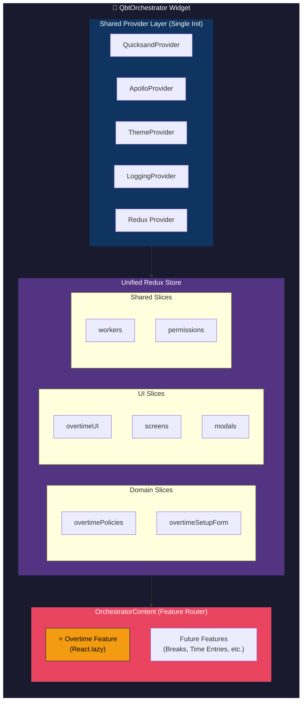
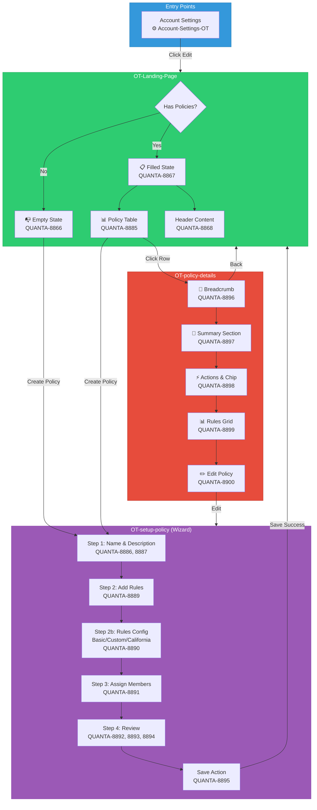
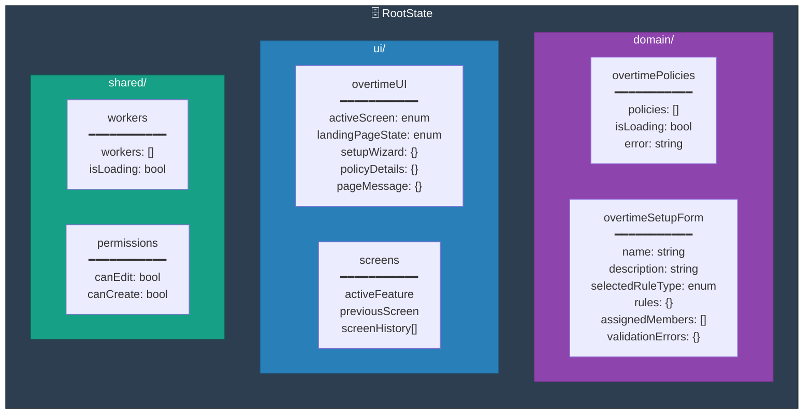
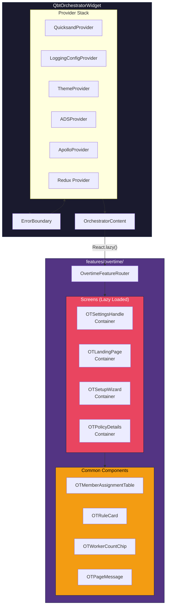
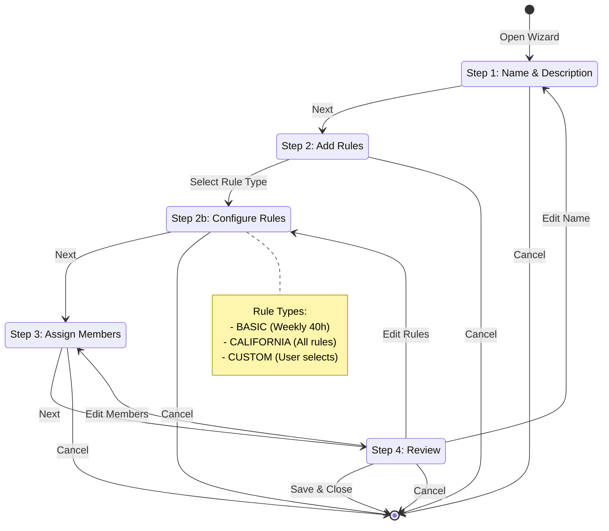
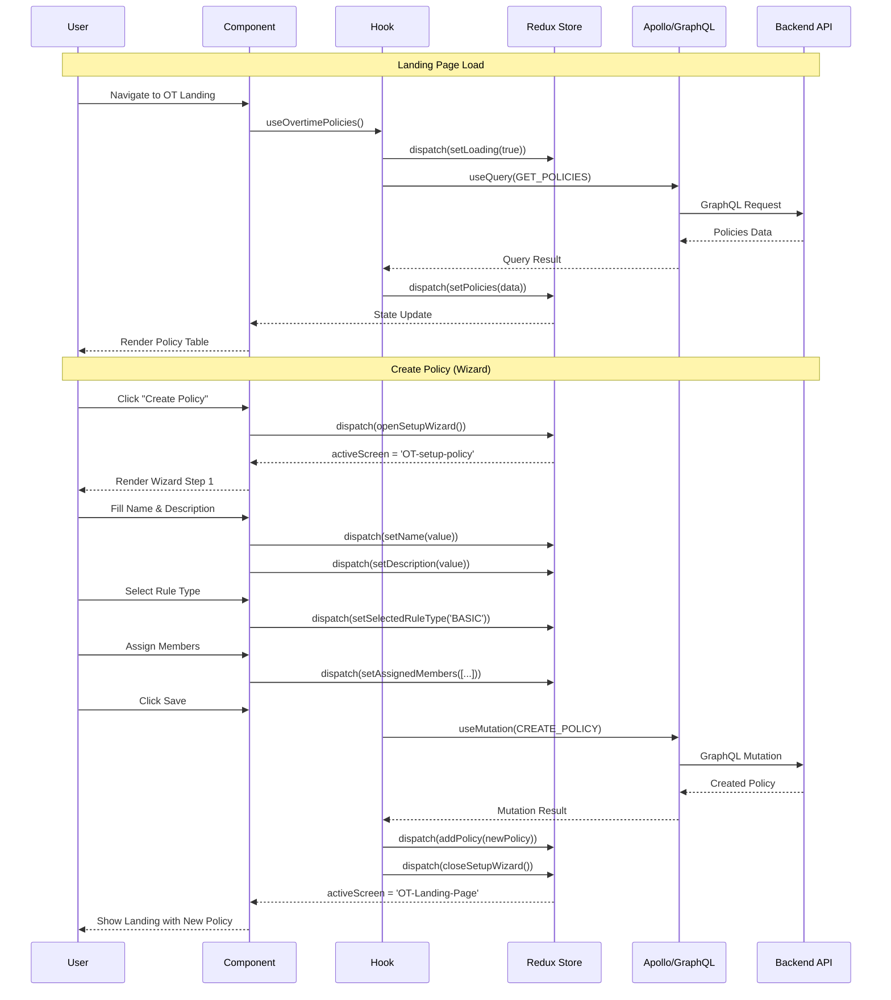
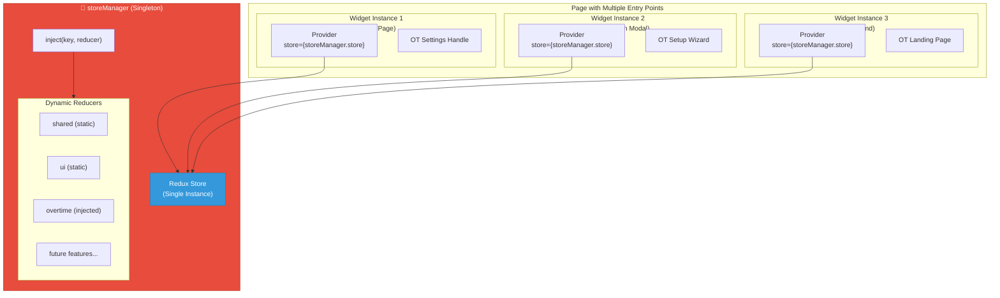
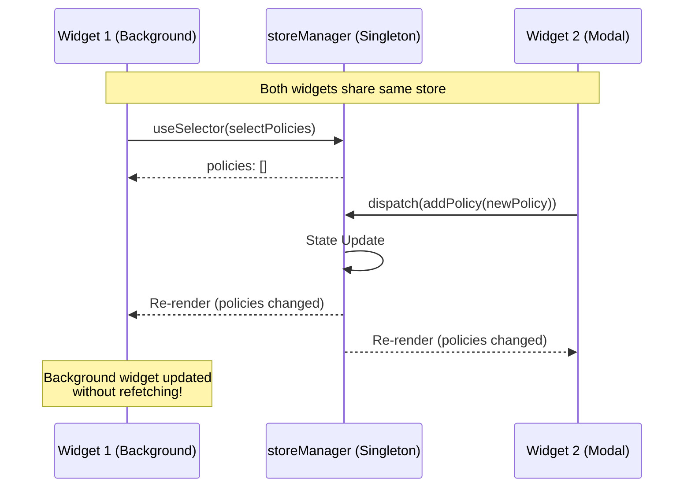

# QbtOrchestrator Widget Architecture

## Table of Contents

1. [Executive Summary](#1-executive-summary)
2. [Problem Statement](#2-problem-statement)
3. [Current Architecture Analysis](#3-current-architecture-analysis)
4. [Proposed Solution: QbtOrchestrator Widget](#4-proposed-solution-qbtorchestrator-widget)
5. [Technical Design](#5-technical-design)
6. [Overtime Feature: First Implementation](#6-overtime-feature-first-implementation)
7. [Implementation Strategy](#7-implementation-strategy)
8. [Future Migration Considerations](#8-future-migration-considerations)
9. [Success Metrics](#9-success-metrics)
10. [Risks and Mitigations](#10-risks-and-mitigations)
11. [Appendix](#11-appendix)

---

## 1. Executive Summary

This document proposes the **QbtOrchestrator Widget** - a unified umbrella widget architecture that consolidates multiple time-tracking feature widgets into a single, cohesive unit with lazy-loaded components and a centralized Redux store.

### First Iteration Approach

**For the first iteration, we will NOT migrate any existing features.** Instead, we will:

1. **Build the QbtOrchestrator shell** with core infrastructure
2. **Implement the Overtime Feature** as the first feature using this new architecture
3. **Validate the pattern** before considering migration of existing widgets

This approach allows us to:
- Prove the architecture with a new feature
- Avoid disrupting existing stable functionality
- Learn and iterate on patterns before large-scale adoption

### Key Benefits

- **40-60% faster initial load times** for subsequent feature navigation
- **Unified state management** across all time-tracking features
- **Reduced bundle size** through shared dependencies and code splitting
- **Improved developer experience** with centralized patterns and reduced boilerplate

---

## 2. Problem Statement

### 2.1 Current Challenge

The Time Tracking UI application has evolved with a **widget-per-feature** approach, resulting in:

```
src/js/widgets/
├── assignments/          # Separate widget + store
├── breaks/               # Separate widget + store  
├── customField/          # Separate widget + store
├── quickFind/            # Separate widget
├── singleTimeTrowser/    # Separate widget (no centralized store)
├── timeClock/            # Separate widget
├── timeEntryLocation/    # Separate widget
├── timeImportAgentic/    # Separate widget
├── timeTrackingSettings/ # Separate widget + store
├── ttoHomePage/          # Separate widget
├── userSettings/         # Separate widget
├── weeklyTimeEntry/      # Separate widget + store
├── weeklyTimeTrowser/    # Separate widget
└── whosworking/          # Separate widget
```

**Total: 14+ independent widgets** with their own initialization, providers, and often separate Redux stores.

### 2.2 Drawbacks of Current Approach

#### 2.2.1 Performance Issues

| Issue | Impact | Severity |
|-------|--------|----------|
| **Multiple Provider Reinitializations** | Each widget wraps with QuicksandProvider, ApolloProvider, ThemeProvider | High |
| **Separate Bundle Loading** | Each widget is a separate entry point requiring full initialization | High |
| **Duplicate Dependencies** | Same dependencies loaded multiple times across widgets | Medium |
| **No Shared State** | Data fetched in one widget must be refetched in another | High |
| **Widget Mounting Overhead** | BaseWidget lifecycle for each feature | Medium |

**Estimated Performance Cost:** 300-800ms additional load time per widget switch

#### 2.2.2 State Management Fragmentation

```
Current State Architecture:
┌─────────────────┐  ┌─────────────────┐  ┌─────────────────┐
│  Breaks Store   │  │ Assignments     │  │ CustomField     │
│  - breakRules   │  │ Store           │  │ Store           │
│  - ui           │  │ - assignments   │  │ - customFields  │
│  - workers      │  │ - filters       │  │ - ui            │
│  - breakEntries │  │ - pagination    │  │                 │
└─────────────────┘  └─────────────────┘  └─────────────────┘
        ↓                   ↓                    ↓
   No Cross-Store Communication - Data Silos
```

**Problems:**
- Worker data fetched separately in Breaks, Assignments, and TimeEntry widgets
- UI state (selected employee, date range) not shared between features
- Form data lost when navigating between widgets
- Duplicate API calls for common entities (workers, customers, jobs)

#### 2.2.3 Developer Experience Issues

| Problem | Description |
|---------|-------------|
| **Boilerplate Overhead** | Each widget requires ~50-100 lines of setup code |
| **Inconsistent Patterns** | Different widgets use different state management approaches |
| **Testing Complexity** | Each widget needs its own test setup and mocks |
| **Code Duplication** | Common functionality reimplemented across widgets |
| **Maintenance Burden** | Provider updates require changes in 14+ locations |

#### 2.2.4 Bundle Size Impact

```
Current Bundle Analysis (Approximate):
├── breaks.bundle.js           ~150KB
├── assignments.bundle.js      ~200KB
├── singleTimeTrowser.bundle.js ~180KB
├── timeClock.bundle.js        ~80KB
├── customField.bundle.js      ~100KB
├── timeTrackingSettings.bundle.js ~120KB
└── ... (8 more widgets)
────────────────────────────────────
Shared Dependencies Duplicated:     ~200KB per widget
Total Redundant Code:              ~2MB+ across all widgets
```

#### 2.2.5 User Experience Degradation

- **Context Loss:** Navigating between features loses current context
- **Loading States:** Multiple loading spinners for different widgets
- **Inconsistent Behavior:** Different error handling across widgets
- **Navigation Friction:** Users experience delays when switching features

#### 2.2.6 Scalability Concerns

| Issue | Impact |
|-------|--------|
| **New Feature = New Widget** | Every new feature adds another isolated widget |
| **Growing Complexity** | Each widget adds to maintenance burden |
| **Team Coordination** | Different teams may implement different patterns |
| **Technical Debt Accumulation** | Harder to enforce standards across widgets |

---

## 3. Current Architecture Analysis

### 3.1 Existing Widget Structure

Each widget currently follows this pattern:

```tsx
// Example: Current Widget Pattern (repeated 14+ times)
export default class FeatureWidget extends BaseWidget<WidgetProps> {
  componentDidMount() {
    this.ready();
  }

  componentDidCatch(error: Error) {
    // Error handling
  }

  render() {
    return (
      <QuicksandProvider sandbox={sandbox}>      {/* Repeated */}
        <ThemeProvider>                          {/* Repeated */}
          <ApolloProvider client={client}>       {/* Repeated */}
            <Provider store={featureStore}>      {/* Isolated Store */}
              <FeatureContent />
            </Provider>
          </ApolloProvider>
        </ThemeProvider>
      </QuicksandProvider>
    );
  }
}
```

### 3.2 Reference: Breaks Widget Pattern (Inspiration)

The Breaks widget demonstrates a promising pattern with **feature-based lazy loading**:

```tsx
// BreaksContent.tsx - Feature Router Pattern
const BreakSettingsHandle = React.lazy(
  () => import('../features/breaks-settings/components/BreakSettingsHandle'),
);

const BreakPreferencesContainer = React.lazy(
  () => import('../features/breaks-settings/components/BreakPreferencesContainer'),
);

const renderFeature = useCallback(() => {
  if (options.feature === 'breaks-settings') {
    if (options.functionality === 'settings-handle') {
      return <BreakSettingsHandle />;
    }
  }
  if (options.feature === 'break-entries') {
    // ...
  }
}, [options]);
```

**Key Insights from Breaks Widget:**
- Centralized Redux store for all break-related features
- Lazy-loaded feature components
- Feature/functionality-based routing
- Shared UI state slice across features

---

## 4. Proposed Solution: QbtOrchestrator Widget

### 4.1 Overview

The **QbtOrchestrator** (QuickBooks Time Orchestrator) is a unified umbrella widget that:

1. **Initializes once** with shared providers (QuicksandProvider, ApolloProvider, ThemeProvider)
2. **Manages a centralized Redux store** for all time-tracking domain state
3. **Lazy-loads feature components** on demand
4. **Provides screen-based UI state management**
5. **Shares common data** (workers, customers, jobs) across all features

### 4.2 Architecture Diagrams (Mermaid)

#### 4.2.1 High-Level Widget Architecture



#### 4.2.2 Overtime Feature - Screen Flow



#### 4.2.3 Redux Store Structure



#### 4.2.4 Component Hierarchy



#### 4.2.5 Setup Wizard State Machine



#### 4.2.6 Data Flow Diagram



### 4.2.7 ASCII Architecture Overview (Fallback)

```
┌──────────────────────────────────────────────────────────────────────────────┐
│                         QbtOrchestrator Widget                               │
├──────────────────────────────────────────────────────────────────────────────┤
│                                                                              │
│  ┌──────────────────────────────────────────────────────────────────────┐   │
│  │                    Shared Provider Layer (Single Init)               │   │
│  │  ┌────────────┐  ┌─────────────┐  ┌────────────┐  ┌──────────────┐  │   │
│  │  │ Quicksand  │  │   Apollo    │  │   Theme    │  │   Logging    │  │   │
│  │  │  Provider  │  │   Provider  │  │  Provider  │  │   Provider   │  │   │
│  │  └────────────┘  └─────────────┘  └────────────┘  └──────────────┘  │   │
│  └──────────────────────────────────────────────────────────────────────┘   │
│                                    │                                         │
│  ┌──────────────────────────────────────────────────────────────────────┐   │
│  │                    Unified Redux Store                               │   │
│  │  ┌─────────────────────────────────────────────────────────────────┐ │   │
│  │  │  Domain Slices         │  UI Slices          │  Shared Slices  │ │   │
│  │  │  ─────────────         │  ─────────          │  ─────────────  │ │   │
│  │  │  • overtimePolicies    │  • overtimeUI       │  • workers      │ │   │
│  │  │  • overtimeSetupForm   │  • screens          │  • permissions  │ │   │
│  │  │  (future features)     │  • modals           │                 │ │   │
│  │  └─────────────────────────────────────────────────────────────────┘ │   │
│  └──────────────────────────────────────────────────────────────────────┘   │
│                                    │                                         │
│  ┌──────────────────────────────────────────────────────────────────────┐   │
│  │                    Feature Router (OrchestratorContent)              │   │
│  │  ┌──────────────────────────────────────────────────────────────┐   │   │
│  │  │              ⭐ OVERTIME FEATURE (Screens)                    │   │   │
│  │  │  ┌─────────────────┐  ┌─────────────────┐  ┌──────────────┐  │   │   │
│  │  │  │ Account-Settings│  │  OT-Landing-    │  │ OT-setup-    │  │   │   │
│  │  │  │       -OT       │  │     Page        │  │   policy     │  │   │   │
│  │  │  └─────────────────┘  └─────────────────┘  └──────────────┘  │   │   │
│  │  │                       ┌─────────────────┐                     │   │   │
│  │  │                       │  OT-policy-     │                     │   │   │
│  │  │                       │    details      │                     │   │   │
│  │  │                       └─────────────────┘                     │   │   │
│  │  └──────────────────────────────────────────────────────────────┘   │   │
│  └──────────────────────────────────────────────────────────────────────┘   │
└──────────────────────────────────────────────────────────────────────────────┘
```

### 4.3 Benefits

#### 4.3.1 Performance Benefits

| Benefit | Description | Expected Improvement |
|---------|-------------|---------------------|
| **Single Provider Init** | Providers initialized once, shared across features | 200-400ms saved per feature switch |
| **Lazy Loading** | Feature chunks loaded only when needed | 60% smaller initial bundle |
| **Shared State** | Common data cached and shared | 50% reduction in API calls |
| **Preloading** | Critical features can be preloaded | Near-instant navigation |

#### 4.3.2 Developer Experience Benefits

- **Single point of truth** for time-tracking domain
- **Consistent patterns** across all features
- **Reduced boilerplate** - no per-widget setup
- **Easier testing** - unified store mocking
- **Better TypeScript** support with centralized types

#### 4.3.3 User Experience Benefits

- **Seamless navigation** between features
- **Preserved context** (selected employee, date range, etc.)
- **Consistent loading states** and error handling
- **Faster perceived performance**

---

## 5. Technical Design

### 5.1 QbtOrchestrator Widget Structure

```
src/js/widgets/qbtOrchestrator/
├── QbtOrchestratorWidget.tsx      # Main widget entry point
├── widget.yaml                    # Widget configuration
├── types.ts                       # Centralized types
├── constants.ts                   # Shared constants
│
├── components/
│   ├── OrchestratorContent.tsx    # Feature router component
│   ├── ErrorBoundary.tsx          # Unified error handling
│   └── SuspenseFallback.tsx       # Loading states
│
├── store/
│   ├── storeManager.ts            # ★ Injectable Singleton Store Manager
│   ├── index.ts                   # Store exports and types
│   ├── hooks.ts                   # Typed Redux hooks (useAppDispatch, useAppSelector)
│   │
│   ├── ui/                        # UI state slices (STATIC - loaded at init)
│   │   ├── screensSlice.ts        # Screen-based UI state
│   │   ├── modalsSlice.ts         # Modal management
│   │   ├── drawersSlice.ts        # Drawer/Trowser state
│   │   └── index.ts               # Combined UI reducer
│   │
│   └── shared/                    # Shared data slices (STATIC - loaded at init)
│       ├── workersSlice.ts        # Worker/Employee data
│       ├── permissionsSlice.ts    # Permission data
│       └── index.ts               # Combined shared reducer
│
├── features/                      # Lazy-loaded feature modules
│   │
│   └── overtime/                  # ★ OVERTIME FEATURE (First Implementation)
│       ├── index.ts               # Feature entry point (with reducer injection)
│       ├── types.ts
│       ├── constants.ts
│       │
│       ├── store/                 # ★ LAZY REDUCERS (injected on demand)
│       │   ├── overtimePoliciesSlice.ts
│       │   ├── overtimeSetupFormSlice.ts
│       │   ├── overtimeUISlice.ts
│       │   └── index.ts
│       │
│       ├── components/
│       │   ├── OvertimeFeatureRouter.tsx
│       │   ├── account-settings/
│       │   ├── landing-page/
│       │   ├── setup-policy/
│       │   ├── policy-details/
│       │   └── common/
│       │
│       ├── hooks/
│       │   ├── useInjectOvertimeReducer.ts  # ★ Reducer injection hook
│       │   ├── useOvertimePolicies.ts
│       │   ├── useOvertimeSetupWizard.ts
│       │   └── useOvertimeAssignments.ts
│       │
│       └── styles/
│           └── Overtime.styled.ts
│
├── hooks/                         # Shared hooks
│   ├── useFeatureLoader.ts
│   ├── useScreenState.ts
│   └── useSharedData.ts
│
├── styles/                        # Shared styles
│   └── Orchestrator.styled.ts
│
└── utils/                         # Shared utilities
    ├── featureRegistry.ts
    └── stateHelpers.ts
```

### 5.2 Core Implementation

#### 5.2.1 QbtOrchestratorWidget.tsx

```tsx
import React, { Suspense } from 'react';
import { ApolloProvider } from '@apollo/client';
import { QuicksandProvider } from '@payroll/quicksand';
import BaseWidget from 'web-shell-core/widgets/BaseWidget';
import { ThemeProvider } from '@design-systems/theme';
import { Provider } from 'react-redux';
import nlsLoader from 'src/nls';
import { getApolloClientInstance } from 'src/js/service/ApolloClientBuilder';
import { LoggingConfigProvider } from 'src/js/providers/LoggingConfigProvider';
import ADSProvider from 'src/js/providers/ADSProvider';

import store from './store';
import OrchestratorContent from './components/OrchestratorContent';
import ErrorBoundary from './components/ErrorBoundary';
import SuspenseFallback from './components/SuspenseFallback';
import { OrchestratorWidgetOptions, WidgetProps } from './types';
import { ORCHESTRATOR_LOGGING } from './constants';

interface OrchestratorProps {
  onError?: (error: Error | string) => void;
}

export default class QbtOrchestratorWidget extends BaseWidget<
  WidgetProps<OrchestratorProps, OrchestratorFeature, OrchestratorFunctionality>
> {
  componentDidMount() {
    const { sandbox } = this.props;
    this.ready();
    sandbox.logger.info(ORCHESTRATOR_LOGGING.WIDGET_MOUNTED);
  }

  componentDidCatch(error: Error) {
    this.props.sandbox.logger.error(
      ORCHESTRATOR_LOGGING.WIDGET_CRASH,
      { error },
    );
    this.props.onError?.(error);
  }

  render() {
    const { sandbox, externalApolloClient, options } = this.props;
    const client = externalApolloClient ?? getApolloClientInstance(sandbox);

    if (!client) {
      sandbox.logger.error(ORCHESTRATOR_LOGGING.APOLLO_CLIENT_ERROR);
      return <div>Error: Apollo client not initialized</div>;
    }

    return (
      <ErrorBoundary 
        onError={this.props.onError}
        logger={sandbox.logger}
      >
        <QuicksandProvider
          sandbox={sandbox}
          nlsLoader={nlsLoader.requireNlsForLocale([
            'timeTrackingUI',
            'overtime',  // ★ Overtime NLS
          ]) as any}
        >
          <LoggingConfigProvider sandbox={sandbox} prefix="QbtOrchestrator">
            <ThemeProvider>
              <ADSProvider>
                <ApolloProvider client={client}>
                  <Provider store={store}>
                    <Suspense fallback={<SuspenseFallback />}>
                      <OrchestratorContent 
                        options={options as OrchestratorWidgetOptions}
                        sandbox={sandbox}
                      />
                    </Suspense>
                  </Provider>
                </ApolloProvider>
              </ADSProvider>
            </ThemeProvider>
          </LoggingConfigProvider>
        </QuicksandProvider>
      </ErrorBoundary>
    );
  }
}
```

#### 5.2.2 OrchestratorContent.tsx (Screen-Based Feature Router)

```tsx
import React, { Suspense, useCallback } from 'react';
import { useDispatch } from 'react-redux';
import { setActiveScreen } from '../store/ui/screensSlice';
import { OrchestratorWidgetOptions, OrchestratorFeature } from '../types';
import SuspenseFallback from './SuspenseFallback';

// ★ Lazy-loaded Overtime Feature (First Implementation)
const OvertimeFeature = React.lazy(
  () => import('../features/overtime')
);

// Future features (to be added later)
// const BreaksFeature = React.lazy(() => import('../features/breaks'));
// const TimeEntriesFeature = React.lazy(() => import('../features/time-entries'));
// const AssignmentsFeature = React.lazy(() => import('../features/assignments'));

interface OrchestratorContentProps {
  options: OrchestratorWidgetOptions;
  sandbox: any;
}

const OrchestratorContent: React.FC<OrchestratorContentProps> = ({
  options,
  sandbox,
}) => {
  const dispatch = useDispatch();
  
  // Track active screen for analytics and state management
  React.useEffect(() => {
    dispatch(setActiveScreen({
      feature: options.feature,
      screen: options.screen,
    }));
  }, [options.feature, options.screen, dispatch]);

  const renderFeature = useCallback(() => {
    const { feature, screen, props } = options;

    switch (feature) {
      // ★ Overtime Feature - First Implementation (Screen-Based)
      case 'overtime':
        return (
          <OvertimeFeature 
            screen={screen}  // Pass screen instead of functionality
            props={props}
          />
        );

      // Future features (not implemented in v1)
      default:
        sandbox.logger.error(`Unknown or not yet implemented feature: ${feature}`);
        return (
          <div className="feature-not-available">
            Feature "{feature}" is not yet available in the orchestrator.
          </div>
        );
    }
  }, [options, sandbox]);

  return (
    <Suspense fallback={<SuspenseFallback feature={options.feature} />}>
      <div className="qbt-orchestrator">
        {renderFeature()}
      </div>
    </Suspense>
  );
};

export default OrchestratorContent;
```

#### 5.2.3 Unified Redux Store (v1 - Overtime Focus)

```tsx
// store/index.ts
import { combineReducers, configureStore } from '@reduxjs/toolkit';

// ★ Overtime Domain slices (First Implementation)
import overtimeReducer from './domain/overtimeSlice';
import overtimeRulesReducer from './domain/overtimeRulesSlice';
import overtimeEntriesReducer from './domain/overtimeEntriesSlice';

// UI slices
import screensReducer from './ui/screensSlice';
import modalsReducer from './ui/modalsSlice';
import drawersReducer from './ui/drawersSlice';
import navigationReducer from './ui/navigationSlice';
import formsReducer from './ui/formsSlice';

// Shared data slices
import workersReducer from './shared/workersSlice';
import customersReducer from './shared/customersSlice';
import jobsReducer from './shared/jobsSlice';
import permissionsReducer from './shared/permissionsSlice';

const rootReducer = combineReducers({
  // ★ Domain state - Overtime (v1)
  domain: combineReducers({
    overtime: overtimeReducer,
    overtimeRules: overtimeRulesReducer,
    overtimeEntries: overtimeEntriesReducer,
    // Future domain slices will be added here as features are migrated
  }),
  
  // UI state (screen-based management)
  ui: combineReducers({
    screens: screensReducer,
    modals: modalsReducer,
    drawers: drawersReducer,
    navigation: navigationReducer,
    forms: formsReducer,
  }),
  
  // Shared data (cached across features)
  shared: combineReducers({
    workers: workersReducer,
    customers: customersReducer,
    jobs: jobsReducer,
    permissions: permissionsReducer,
  }),
});

const store = configureStore({
  reducer: rootReducer,
  middleware: (getDefaultMiddleware) =>
    getDefaultMiddleware({
      serializableCheck: {
        ignoredActions: ['persist/PERSIST'],
      },
    }),
  devTools:
    process.env.NODE_ENV !== 'production'
      ? { name: 'QBT Orchestrator Store' }
      : false,
});

export type RootState = ReturnType<typeof rootReducer>;
export type AppDispatch = typeof store.dispatch;
export default store;
```

#### 5.2.4 Dynamic Reducer Injection (Multiple Entry Points)

This section explains how to handle the **"multiple entry points"** problem while maintaining a clean, code-split bundle.

##### 5.2.4.1 The Architectural Strategy

To support multiple widgets rendered from different entry points while sharing a single source of truth, the architecture moves the Redux store from a "Static" declaration to an **"Injectable Singleton."** This allows features to register their logic only when they are mounted, preventing the initial bundle from becoming bloated.



##### 5.2.4.2 Core Implementation: The Store Manager

The `storeManager` is a standalone utility that lives outside the React lifecycle. It holds the reference to the singleton store and handles the logic for merging new feature reducers.

```typescript
// store/storeManager.ts
import { configureStore, combineReducers, Reducer, AnyAction } from '@reduxjs/toolkit';

// Static reducers - always loaded
import sharedReducer from './shared';
import uiReducer from './ui';

type ReducerMap = { [key: string]: Reducer<any, AnyAction> };

const staticReducers: ReducerMap = {
  shared: sharedReducer,  // Auth, Workers, Permissions, Config
  ui: uiReducer,          // Active Screen, Modals, Drawer State
};

const createStoreManager = () => {
  let asyncReducers: ReducerMap = {};
  
  const createRootReducer = () => {
    return combineReducers({
      ...staticReducers,
      ...asyncReducers,
    });
  };

  const store = configureStore({
    reducer: createRootReducer(),
    middleware: (getDefaultMiddleware) =>
      getDefaultMiddleware({
        serializableCheck: {
          ignoredActions: ['persist/PERSIST'],
        },
      }),
    devTools:
      process.env.NODE_ENV !== 'production'
        ? { name: 'QBT Orchestrator Store' }
        : false,
  });

  return {
    store,
    
    /**
     * Dynamically inject a feature reducer
     * @param key - The slice key (e.g., 'overtime', 'breaks')
     * @param asyncReducer - The reducer to inject
     */
    inject: (key: string, asyncReducer: Reducer) => {
      if (!asyncReducers[key]) {
        asyncReducers[key] = asyncReducer;
        // replaceReducer triggers state preservation and update
        store.replaceReducer(createRootReducer());
        
        if (process.env.NODE_ENV !== 'production') {
          console.log(`[StoreManager] Injected reducer: ${key}`);
        }
      }
    },
    
    /**
     * Check if a reducer is already injected
     */
    hasReducer: (key: string): boolean => {
      return !!asyncReducers[key];
    },
    
    /**
     * Get current reducer keys (for debugging)
     */
    getReducerKeys: (): string[] => {
      return [...Object.keys(staticReducers), ...Object.keys(asyncReducers)];
    },
  };
};

// Singleton export - same instance across all imports
export const storeManager = createStoreManager();
export type RootState = ReturnType<typeof storeManager.store.getState>;
export type AppDispatch = typeof storeManager.store.dispatch;
```

##### 5.2.4.3 Feature-Level Registration

Each lazy-loaded feature uses a specialized hook or a `useEffect` within its entry component to register its reducer. This ensures that the **Overtime** state doesn't exist until the **Overtime** widget is actually called.

```tsx
// features/overtime/hooks/useInjectOvertimeReducer.ts
import { useEffect, useRef } from 'react';
import { storeManager } from '../../../store/storeManager';
import overtimePoliciesReducer from '../store/overtimePoliciesSlice';
import overtimeSetupFormReducer from '../store/overtimeSetupFormSlice';
import overtimeUIReducer from '../store/overtimeUISlice';

/**
 * Hook to inject Overtime reducers on first mount
 * Safe to call multiple times - only injects once
 */
export const useInjectOvertimeReducer = () => {
  const isInjected = useRef(false);
  
  useEffect(() => {
    if (!isInjected.current) {
      // Inject all overtime-related reducers
      storeManager.inject('overtimePolicies', overtimePoliciesReducer);
      storeManager.inject('overtimeSetupForm', overtimeSetupFormReducer);
      storeManager.inject('overtimeUI', overtimeUIReducer);
      
      isInjected.current = true;
    }
  }, []);
  
  return storeManager.hasReducer('overtimePolicies');
};
```

```tsx
// features/overtime/index.ts
import React, { Suspense } from 'react';
import { useInjectOvertimeReducer } from './hooks/useInjectOvertimeReducer';
import OvertimeFeatureRouter from './components/OvertimeFeatureRouter';
import { OvertimeScreen } from '../../types';

interface OvertimeFeatureProps {
  screen: OvertimeScreen;
  props?: any;
}

const OvertimeFeature: React.FC<OvertimeFeatureProps> = ({ screen, props }) => {
  // Dynamic injection on mount - safe to call multiple times
  const isReady = useInjectOvertimeReducer();
  
  if (!isReady) {
    return <div>Initializing overtime module...</div>;
  }
  
  return (
    <Suspense fallback={<div>Loading overtime...</div>}>
      <OvertimeFeatureRouter screen={screen} props={props} />
    </Suspense>
  );
};

export default OvertimeFeature;
```

##### 5.2.4.4 Updated Widget Implementation

The widget now uses `storeManager.store` instead of a static store import:

```tsx
// QbtOrchestratorWidget.tsx
import React, { Suspense } from 'react';
import { Provider } from 'react-redux';
import { storeManager } from './store/storeManager';
// ... other imports

export default class QbtOrchestratorWidget extends BaseWidget<WidgetProps> {
  render() {
    const { sandbox, externalApolloClient, options } = this.props;
    const client = externalApolloClient ?? getApolloClientInstance(sandbox);

    return (
      <ErrorBoundary onError={this.props.onError} logger={sandbox.logger}>
        <QuicksandProvider sandbox={sandbox} nlsLoader={nlsLoader}>
          <LoggingConfigProvider sandbox={sandbox} prefix="QbtOrchestrator">
            <ThemeProvider>
              <ADSProvider>
                <ApolloProvider client={client}>
                  {/* Use singleton store from storeManager */}
                  <Provider store={storeManager.store}>
                    <Suspense fallback={<SuspenseFallback />}>
                      <OrchestratorContent 
                        options={options}
                        sandbox={sandbox}
                      />
                    </Suspense>
                  </Provider>
                </ApolloProvider>
              </ADSProvider>
            </ThemeProvider>
          </LoggingConfigProvider>
        </QuicksandProvider>
      </ErrorBoundary>
    );
  }
}
```

##### 5.2.4.5 How State is Shared (Cross-Entry Points)

Because the `storeManager` is a singleton, the following behavior is guaranteed across all widgets on the page:

| Behavior | Description |
|----------|-------------|
| **Reference Equality** | Every `<Provider store={storeManager.store}>` across different DOM nodes points to the exact same object in memory |
| **Reactive Updates** | When **Widget A** dispatches an action to the `shared` slice, **Widget B** (rendered in a different part of the DOM) will automatically re-render via its `useSelector` hooks |
| **Background Persistence** | In the "Full Screen Modal" scenario, the background widget remains subscribed to the store. When the modal updates data and closes, the background widget is already "aware" of the changes without re-fetching |
| **No State Duplication** | All widgets share the same state - no need to sync between instances |



##### 5.2.4.6 State Hierarchy Summary

| Slice Level | Responsibility | Lifecycle | Examples |
|-------------|---------------|-----------|----------|
| **Shared (Static)** | Auth, Workers, Permissions, Config | App Load | `workersSlice`, `permissionsSlice` |
| **UI (Static)** | Active Screen, Active Modal, Drawer State | App Load | `screensSlice`, `modalsSlice` |
| **Feature (Lazy)** | Overtime Data, Break Validation, Feature Forms | On-Demand | `overtimePoliciesSlice`, `overtimeSetupFormSlice` |

##### 5.2.4.7 Benefits of Dynamic Injection

| Benefit | Description |
|---------|-------------|
| **Smaller Initial Bundle** | Feature reducers not loaded until needed |
| **Code Splitting Works** | Webpack can split feature code effectively |
| **Single Source of Truth** | All widgets share same state |
| **No Race Conditions** | Singleton pattern prevents multiple store instances |
| **DevTools Friendly** | All state visible in single Redux DevTools instance |
| **Hot Module Replacement** | Works seamlessly with HMR during development |

#### 5.2.5 Screen-Based UI State Management

```tsx
// store/ui/screensSlice.ts
import { createSlice, PayloadAction } from '@reduxjs/toolkit';
import { OrchestratorFeature, OrchestratorFunctionality } from '../../types';

interface ScreenState {
  activeFeature: OrchestratorFeature | null;
  activeFunctionality: OrchestratorFunctionality | null;
  previousScreen: {
    feature: OrchestratorFeature;
    functionality: OrchestratorFunctionality;
  } | null;
  screenHistory: Array<{
    feature: OrchestratorFeature;
    functionality: OrchestratorFunctionality;
    timestamp: number;
  }>;
  isLoading: boolean;
  loadingFeature: OrchestratorFeature | null;
}

const initialState: ScreenState = {
  activeFeature: null,
  activeFunctionality: null,
  previousScreen: null,
  screenHistory: [],
  isLoading: false,
  loadingFeature: null,
};

const screensSlice = createSlice({
  name: 'screens',
  initialState,
  reducers: {
    setActiveScreen: (
      state,
      action: PayloadAction<{
        feature: OrchestratorFeature;
        functionality: OrchestratorFunctionality;
      }>
    ) => {
      // Save previous screen for back navigation
      if (state.activeFeature && state.activeFunctionality) {
        state.previousScreen = {
          feature: state.activeFeature,
          functionality: state.activeFunctionality,
        };
        
        // Add to history (limit to 10 entries)
        state.screenHistory.push({
          feature: state.activeFeature,
          functionality: state.activeFunctionality,
          timestamp: Date.now(),
        });
        if (state.screenHistory.length > 10) {
          state.screenHistory.shift();
        }
      }
      
      state.activeFeature = action.payload.feature;
      state.activeFunctionality = action.payload.functionality;
      state.isLoading = false;
      state.loadingFeature = null;
    },
    
    setScreenLoading: (
      state,
      action: PayloadAction<OrchestratorFeature | null>
    ) => {
      state.isLoading = !!action.payload;
      state.loadingFeature = action.payload;
    },
    
    navigateBack: (state) => {
      if (state.previousScreen) {
        state.activeFeature = state.previousScreen.feature;
        state.activeFunctionality = state.previousScreen.functionality;
        state.previousScreen = state.screenHistory.pop()?.feature
          ? {
              feature: state.screenHistory[state.screenHistory.length - 1]?.feature!,
              functionality: state.screenHistory[state.screenHistory.length - 1]?.functionality!,
            }
          : null;
      }
    },
    
    clearScreenHistory: (state) => {
      state.screenHistory = [];
      state.previousScreen = null;
    },
  },
});

export const {
  setActiveScreen,
  setScreenLoading,
  navigateBack,
  clearScreenHistory,
} = screensSlice.actions;

// Selectors
export const selectActiveScreen = (state: { ui: { screens: ScreenState } }) => ({
  feature: state.ui.screens.activeFeature,
  functionality: state.ui.screens.activeFunctionality,
});

export const selectPreviousScreen = (state: { ui: { screens: ScreenState } }) =>
  state.ui.screens.previousScreen;

export const selectIsScreenLoading = (state: { ui: { screens: ScreenState } }) =>
  state.ui.screens.isLoading;

export const selectScreenHistory = (state: { ui: { screens: ScreenState } }) =>
  state.ui.screens.screenHistory;

export default screensSlice.reducer;
```

### 5.3 Type Definitions (v1 - Screen-Based Overtime)

```tsx
// types.ts
import { Sandbox } from '@payroll/quicksand';

// ==========================================
// Feature Types (v1 - Overtime Only)
// ==========================================
export type OrchestratorFeature = 'overtime';
// Future: | 'breaks' | 'time-entries' | 'assignments' | 'time-clock' | 'settings' | 'custom-fields';

// ==========================================
// Screen Types (Based on Jira Labels)
// ==========================================

// Overtime Screens (from QUANTA-7943 epic labels)
export type OvertimeScreen =
  | 'Account-Settings-OT'   // QUANTA-8864 - Settings handle
  | 'OT-Landing-Page'       // QUANTA-8866, 8867, 8868, 8885 - Main landing page
  | 'OT-setup-policy'       // QUANTA-8886-8895 - Setup wizard
  | 'OT-policy-details';    // QUANTA-8896-8900 - Policy details view

export type OrchestratorScreen = OvertimeScreen;
// Future: | BreaksScreen | TimeEntriesScreen | ...

// ==========================================
// Widget Options (Screen-Based)
// ==========================================
export type OrchestratorWidgetOptions = {
  feature: 'overtime';
  screen: OvertimeScreen;
  props?: OvertimeScreenProps;
};

// ==========================================
// Screen Props Interfaces
// ==========================================

export interface OvertimeScreenProps {
  // Account-Settings-OT
  isEditable?: boolean;
  
  // OT-Landing-Page
  onCreatePolicy?: () => void;
  onEditPolicy?: (policyId: string) => void;
  
  // OT-setup-policy
  onClose?: () => void;
  onSave?: (data: any) => void;
  
  // OT-policy-details
  policyId?: string;
  onBack?: () => void;
}

// ==========================================
// Generic Widget Props
// ==========================================
export interface WidgetProps<
  TProps,
  TFeature extends OrchestratorFeature,
  TScreen extends OrchestratorScreen
> {
  sandbox: Sandbox;
  externalApolloClient?: any;
  options: {
    feature: TFeature;
    screen: TScreen;
    props?: TProps;
  };
  onError?: (error: Error | string) => void;
}
```

---

## 6. Overtime Feature: First Implementation

### 6.1 Overview

The **Overtime Feature** will be the first feature implemented using the QbtOrchestrator pattern. This provides a clean slate to validate the architecture without disrupting existing functionality.

**Reference:** Epic [QUANTA-7943](https://jira.intuit.com/browse/QUANTA-7943)

### 6.2 Overtime Feature Requirements

#### 6.2.1 Business Context

Overtime management allows employers to:
- Define overtime rules and policies (e.g., time-and-a-half after 40 hours/week)
- Assign overtime rules to workers
- Track overtime hours and calculations
- Support different OT types: Basic, California, and Custom

#### 6.2.2 Screens (Based on Jira Labels)

The Overtime feature consists of **4 main screens** plus common/shared components:

| Screen Label | Screen Name | Description |
|--------------|-------------|-------------|
| `Account-Settings-OT` | Account Settings OT Section | Entry point in Account Settings page |
| `OT-Landing-Page` | Overtime Landing Page | Main OT page with policy list (empty/filled states) |
| `OT-setup-policy` | Setup OT Policy Wizard | Multi-step wizard to create OT policy |
| `OT-policy-details` | OT Policy Details | View/edit existing OT policy details |
| `OT-common` | Common OT Components | Shared components (member assignment table, etc.) |

#### 6.2.3 Screen-wise Functionality Matrix

##### Screen 1: Account Settings OT Section (`Account-Settings-OT`)

| Jira | Functionality | Description |
|------|---------------|-------------|
| [QUANTA-8864](https://jira.intuit.com/browse/QUANTA-8864) | `settings-handle` | OT Settings section in Account Settings with edit icon (permission-based) |

**Figma:** [Account Settings OT](https://www.figma.com/design/K5qZP1hLxGBBuyrZLACfez/-R5--%E2%80%93-Overtime?node-id=6718-60262&m=dev)

---

##### Screen 2: Overtime Landing Page (`OT-Landing-Page`)

| Jira | Functionality | Description |
|------|---------------|-------------|
| [QUANTA-8866](https://jira.intuit.com/browse/QUANTA-8866) | `landing-empty-state` | Empty state for new companies with no policies |
| [QUANTA-8867](https://jira.intuit.com/browse/QUANTA-8867) | `landing-filled-state` | Filled state showing existing policies |
| [QUANTA-8868](https://jira.intuit.com/browse/QUANTA-8868) | `landing-header` | Header copy content |
| [QUANTA-8885](https://jira.intuit.com/browse/QUANTA-8885) | `landing-policy-table` | Paginated table with edit action for OT policies |

**Figma Links:**
- [Empty State](https://www.figma.com/design/K5qZP1hLxGBBuyrZLACfez/-R5--%E2%80%93-Overtime?node-id=6718-59476&m=dev)
- [Filled State](https://www.figma.com/design/K5qZP1hLxGBBuyrZLACfez/-R5--%E2%80%93-Overtime?node-id=6718-61161&m=dev)
- [Policy Table](https://www.figma.com/design/K5qZP1hLxGBBuyrZLACfez/-R5--%E2%80%93-Overtime?node-id=6718-61177&m=dev)

---

##### Screen 3: Setup OT Policy Wizard (`OT-setup-policy`)

| Jira | Functionality | Description |
|------|---------------|-------------|
| [QUANTA-8886](https://jira.intuit.com/browse/QUANTA-8886) | `setup-init` | OT Slice config to show setup UI |
| [QUANTA-8887](https://jira.intuit.com/browse/QUANTA-8887) | `setup-description` | OT description input with redux actions |
| [QUANTA-8888](https://jira.intuit.com/browse/QUANTA-8888) | `setup-wizard-menu` | OT Wizard menu for setup with redux wiring |
| [QUANTA-8889](https://jira.intuit.com/browse/QUANTA-8889) | `setup-add-rules` | Add Overtime Rules selection |
| [QUANTA-8890](https://jira.intuit.com/browse/QUANTA-8890) | `setup-rules-config` | Add OT Rules - Basic/Custom/California config |
| [QUANTA-8891](https://jira.intuit.com/browse/QUANTA-8891) | `setup-member-assignment` | Policy Member Assignment Table |
| [QUANTA-8892](https://jira.intuit.com/browse/QUANTA-8892) | `setup-review-name` | Policy Creation Review - Name section |
| [QUANTA-8893](https://jira.intuit.com/browse/QUANTA-8893) | `setup-review-rules` | Policy Creation Review - OT Rules section |
| [QUANTA-8894](https://jira.intuit.com/browse/QUANTA-8894) | `setup-review-members` | Policy Creation Review - OT Policy members section |
| [QUANTA-8895](https://jira.intuit.com/browse/QUANTA-8895) | `setup-save-action` | Policy Creation Review - Save Action |

**Figma Links:**
- [Setup Init](https://www.figma.com/design/K5qZP1hLxGBBuyrZLACfez/-R5--%E2%80%93-Overtime?node-id=6718-60357&m=dev)
- [Description Input](https://www.figma.com/design/K5qZP1hLxGBBuyrZLACfez/-R5--%E2%80%93-Overtime?node-id=6718-60359&m=dev)
- [Wizard Menu](https://www.figma.com/design/K5qZP1hLxGBBuyrZLACfez/-R5--%E2%80%93-Overtime?node-id=6718-60373&m=dev)
- [Add Rules](https://www.figma.com/design/K5qZP1hLxGBBuyrZLACfez/-R5--%E2%80%93-Overtime?node-id=6718-60384&m=dev)
- [Basic Rules](https://www.figma.com/design/K5qZP1hLxGBBuyrZLACfez/-R5--%E2%80%93-Overtime?node-id=6718-59578&m=dev)
- [Custom Rules](https://www.figma.com/design/K5qZP1hLxGBBuyrZLACfez/-R5--%E2%80%93-Overtime?node-id=6718-60420&m=dev)
- [Member Assignment](https://www.figma.com/design/K5qZP1hLxGBBuyrZLACfez/-R5--%E2%80%93-Overtime?node-id=6718-57897&m=dev)
- [Review - Name](https://www.figma.com/design/K5qZP1hLxGBBuyrZLACfez/-R5--%E2%80%93-Overtime?node-id=6718-59726&m=dev)
- [Review - Rules](https://www.figma.com/design/K5qZP1hLxGBBuyrZLACfez/-R5--%E2%80%93-Overtime?node-id=6718-59767&m=dev)
- [Review - Members](https://www.figma.com/design/K5qZP1hLxGBBuyrZLACfez/-R5--%E2%80%93-Overtime?node-id=6718-59801&m=dev)
- [Save Action](https://www.figma.com/design/K5qZP1hLxGBBuyrZLACfez/-R5--%E2%80%93-Overtime?node-id=6718-59819&m=dev)

---

##### Screen 4: OT Policy Details (`OT-policy-details`)

| Jira | Functionality | Description |
|------|---------------|-------------|
| [QUANTA-8896](https://jira.intuit.com/browse/QUANTA-8896) | `details-breadcrumb` | Breadcrumb to navigate back to OT policy list |
| [QUANTA-8897](https://jira.intuit.com/browse/QUANTA-8897) | `details-summary` | OT policy Summary Section |
| [QUANTA-8898](https://jira.intuit.com/browse/QUANTA-8898) | `details-actions` | Assigned worker count chip and Action buttons |
| [QUANTA-8899](https://jira.intuit.com/browse/QUANTA-8899) | `details-rules-grid` | Overtime rules grid display |
| [QUANTA-8900](https://jira.intuit.com/browse/QUANTA-8900) | `details-edit-policy` | Edit policy screen (reuse from setup) |

**Figma Links:**
- [Breadcrumb](https://www.figma.com/design/K5qZP1hLxGBBuyrZLACfez/-R5--%E2%80%93-Overtime?node-id=6718-59825&m=dev)
- [Summary Section](https://www.figma.com/design/K5qZP1hLxGBBuyrZLACfez/-R5--%E2%80%93-Overtime?node-id=6718-59827&m=dev)
- [Actions & Chip](https://www.figma.com/design/K5qZP1hLxGBBuyrZLACfez/-R5--%E2%80%93-Overtime?node-id=6718-59831&m=dev)
- [Rules Grid](https://www.figma.com/design/K5qZP1hLxGBBuyrZLACfez/-R5--%E2%80%93-Overtime?node-id=6718-59837&m=dev)
- [Edit Policy](https://www.figma.com/design/K5qZP1hLxGBBuyrZLACfez/-R5--%E2%80%93-Overtime?node-id=6718-59877&m=dev)

---

##### Infrastructure Stories

| Jira | Description |
|------|-------------|
| [QUANTA-8862](https://jira.intuit.com/browse/QUANTA-8862) | Create QBTOrchestrator Widget (Redux Store, Slices, Apollo, Logging) |
| [QUANTA-8863](https://jira.intuit.com/browse/QUANTA-8863) | Create Overtime Feature Flag in e2e and prod |

#### 6.2.4 Screen Navigation Flow

```
┌─────────────────────────────────────────────────────────────────────────────┐
│                         OVERTIME SCREEN FLOW                                │
├─────────────────────────────────────────────────────────────────────────────┤
│                                                                             │
│  ┌──────────────────┐                                                       │
│  │  Account Settings│──────────► Entry point with edit icon                │
│  │  (settings-handle)            (permission-based)                         │
│  └────────┬─────────┘                                                       │
│           │                                                                 │
│           ▼                                                                 │
│  ┌──────────────────┐                                                       │
│  │ OT Landing Page  │                                                       │
│  │                  │                                                       │
│  │ ┌──────────────┐ │     ┌──────────────────────────────────────────────┐ │
│  │ │ Empty State  │ │────►│         OT Setup Policy Wizard               │ │
│  │ │ (no policies)│ │     │                                              │ │
│  │ └──────────────┘ │     │  Step 1: Name & Description                  │ │
│  │                  │     │  Step 2: Add OT Rules (Basic/Custom/CA)      │ │
│  │ ┌──────────────┐ │     │  Step 3: Assign Members                      │ │
│  │ │ Filled State │ │     │  Step 4: Review & Save                       │ │
│  │ │ (with table) │ │     │                                              │ │
│  │ └──────┬───────┘ │     └──────────────────────────────────────────────┘ │
│  └────────┼─────────┘                                                       │
│           │                                                                 │
│           │ Click on policy row                                             │
│           ▼                                                                 │
│  ┌──────────────────────────────────────────────────────────────────────┐  │
│  │                    OT Policy Details Screen                          │  │
│  │                                                                      │  │
│  │  ┌─────────────┐  ┌─────────────────┐  ┌──────────────────────────┐ │  │
│  │  │ Breadcrumb  │  │ Summary Section │  │ Actions (Assign/Edit)    │ │  │
│  │  │ (back nav)  │  │ (policy info)   │  │ Worker Count Chip        │ │  │
│  │  └─────────────┘  └─────────────────┘  └──────────────────────────┘ │  │
│  │                                                                      │  │
│  │  ┌────────────────────────────────────────────────────────────────┐ │  │
│  │  │                     OT Rules Grid                              │ │  │
│  │  │   (Daily OT, Weekly OT, Consecutive Days, etc.)                │ │  │
│  │  └────────────────────────────────────────────────────────────────┘ │  │
│  └──────────────────────────────────────────────────────────────────────┘  │
│                                                                             │
└─────────────────────────────────────────────────────────────────────────────┘
```

### 6.3 Overtime Feature Structure

```
features/overtime/
├── index.ts                           # Feature entry point with lazy routing
│
├── components/
│   ├── OvertimeFeatureRouter.tsx      # Routes to screens based on UI state
│   │
│   │── account-settings/              # Screen: Account-Settings-OT
│   │   ├── OTSettingsHandleContainer.tsx   # Smart container
│   │   └── OTSettingsHandle.tsx            # Presentational (settings entry point)
│   │
│   ├── landing-page/                  # Screen: OT-Landing-Page
│   │   ├── OTLandingPageContainer.tsx      # Smart container
│   │   ├── OTLandingPage.tsx               # Presentational
│   │   ├── OTEmptyState.tsx                # Empty state (no policies)
│   │   ├── OTFilledState.tsx               # Filled state (with policies)
│   │   ├── OTLandingHeader.tsx             # Header copy content
│   │   └── OTPolicyTable.tsx               # Paginated policy table
│   │
│   ├── setup-policy/                  # Screen: OT-setup-policy
│   │   ├── OTSetupWizardContainer.tsx      # Smart container (wizard state)
│   │   ├── OTSetupWizard.tsx               # Presentational (wizard shell)
│   │   ├── OTWizardMenu.tsx                # Wizard step menu
│   │   ├── steps/
│   │   │   ├── OTNameDescriptionStep.tsx   # Step 1: Name & Description
│   │   │   ├── OTAddRulesStep.tsx          # Step 2: Add OT Rules
│   │   │   ├── OTRulesConfigStep.tsx       # Step 2b: Rules Config (Basic/Custom/CA)
│   │   │   ├── OTMemberAssignmentStep.tsx  # Step 3: Assign Members
│   │   │   └── OTReviewStep.tsx            # Step 4: Review & Save
│   │   └── review/
│   │       ├── OTReviewNameSection.tsx     # Review - Name section
│   │       ├── OTReviewRulesSection.tsx    # Review - Rules section
│   │       └── OTReviewMembersSection.tsx  # Review - Members section
│   │
│   ├── policy-details/                # Screen: OT-policy-details
│   │   ├── OTPolicyDetailsContainer.tsx    # Smart container
│   │   ├── OTPolicyDetails.tsx             # Presentational
│   │   ├── OTPolicyBreadcrumb.tsx          # Breadcrumb navigation
│   │   ├── OTPolicySummary.tsx             # Policy summary section
│   │   ├── OTPolicyActions.tsx             # Action buttons + worker count chip
│   │   ├── OTRulesGrid.tsx                 # Overtime rules grid
│   │   └── OTEditPolicyDrawer.tsx          # Edit policy (reuse setup components)
│   │
│   └── common/                        # Screen: OT-common (shared components)
│       ├── OTMemberAssignmentTable.tsx     # Policy member assignment table
│       ├── OTRuleCard.tsx                  # Single rule card component
│       ├── OTWorkerCountChip.tsx           # Worker count chip
│       └── OTPageMessage.tsx               # Page-level messages
│
├── hooks/
│   ├── useOvertimePolicies.ts         # CRUD operations for policies
│   ├── useOvertimePolicyCrud.ts       # Create/Update/Delete policy
│   ├── useOvertimeRules.ts            # Fetch OT rules (Basic/Custom/CA)
│   ├── useOvertimeAssignments.ts      # Worker assignments to policies
│   ├── useOvertimeSetupWizard.ts      # Wizard state management
│   └── useOvertimeLandingPage.ts      # Landing page data fetching
│
├── styles/
│   ├── OTLandingPage.styled.ts
│   ├── OTSetupWizard.styled.ts
│   ├── OTPolicyDetails.styled.ts
│   └── OTCommon.styled.ts
│
├── types.ts                           # Overtime-specific types
├── constants.ts                       # Overtime constants
└── utils.ts                           # Overtime utilities
```

### 6.4 Overtime Domain State (Screen-Based)

#### 6.4.1 UI Slice for Screen Management

```tsx
// store/ui/overtimeUISlice.ts
import { createSlice, PayloadAction } from '@reduxjs/toolkit';

// Screen identifiers matching Jira labels
export type OvertimeScreen = 
  | 'Account-Settings-OT'
  | 'OT-Landing-Page'
  | 'OT-setup-policy'
  | 'OT-policy-details';

// Setup wizard steps
export type SetupWizardStep = 
  | 'name-description'
  | 'add-rules'
  | 'rules-config'
  | 'member-assignment'
  | 'review';

interface OvertimeUIState {
  // Current screen
  activeScreen: OvertimeScreen;
  
  // Landing page state
  landingPageState: 'empty' | 'filled' | 'loading' | 'error';
  
  // Setup wizard state
  setupWizard: {
    isOpen: boolean;
    currentStep: SetupWizardStep;
    completedSteps: SetupWizardStep[];
  };
  
  // Policy details state
  policyDetails: {
    selectedPolicyId: string | null;
    isEditDrawerOpen: boolean;
    isAssignMembersDrawerOpen: boolean;
  };
  
  // Common UI state
  pageMessage: {
    show: boolean;
    type: 'success' | 'error' | 'warning' | 'info';
    message: string;
  };
}

const initialState: OvertimeUIState = {
  activeScreen: 'OT-Landing-Page',
  landingPageState: 'loading',
  setupWizard: {
    isOpen: false,
    currentStep: 'name-description',
    completedSteps: [],
  },
  policyDetails: {
    selectedPolicyId: null,
    isEditDrawerOpen: false,
    isAssignMembersDrawerOpen: false,
  },
  pageMessage: {
    show: false,
    type: 'info',
    message: '',
  },
};

const overtimeUISlice = createSlice({
  name: 'overtimeUI',
  initialState,
  reducers: {
    // Screen navigation
    setActiveScreen: (state, action: PayloadAction<OvertimeScreen>) => {
      state.activeScreen = action.payload;
    },
    
    // Landing page
    setLandingPageState: (state, action: PayloadAction<'empty' | 'filled' | 'loading' | 'error'>) => {
      state.landingPageState = action.payload;
    },
    
    // Setup wizard
    openSetupWizard: (state) => {
      state.setupWizard.isOpen = true;
      state.setupWizard.currentStep = 'name-description';
      state.setupWizard.completedSteps = [];
      state.activeScreen = 'OT-setup-policy';
    },
    closeSetupWizard: (state) => {
      state.setupWizard.isOpen = false;
      state.activeScreen = 'OT-Landing-Page';
    },
    setWizardStep: (state, action: PayloadAction<SetupWizardStep>) => {
      state.setupWizard.currentStep = action.payload;
    },
    completeWizardStep: (state, action: PayloadAction<SetupWizardStep>) => {
      if (!state.setupWizard.completedSteps.includes(action.payload)) {
        state.setupWizard.completedSteps.push(action.payload);
      }
    },
    
    // Policy details
    openPolicyDetails: (state, action: PayloadAction<string>) => {
      state.policyDetails.selectedPolicyId = action.payload;
      state.activeScreen = 'OT-policy-details';
    },
    closePolicyDetails: (state) => {
      state.policyDetails.selectedPolicyId = null;
      state.activeScreen = 'OT-Landing-Page';
    },
    toggleEditDrawer: (state, action: PayloadAction<boolean>) => {
      state.policyDetails.isEditDrawerOpen = action.payload;
    },
    toggleAssignMembersDrawer: (state, action: PayloadAction<boolean>) => {
      state.policyDetails.isAssignMembersDrawerOpen = action.payload;
    },
    
    // Page message
    showPageMessage: (state, action: PayloadAction<{
      type: 'success' | 'error' | 'warning' | 'info';
      message: string;
    }>) => {
      state.pageMessage = { show: true, ...action.payload };
    },
    clearPageMessage: (state) => {
      state.pageMessage = { show: false, type: 'info', message: '' };
    },
    
    // Reset
    resetOvertimeUI: () => initialState,
  },
});

export const {
  setActiveScreen,
  setLandingPageState,
  openSetupWizard,
  closeSetupWizard,
  setWizardStep,
  completeWizardStep,
  openPolicyDetails,
  closePolicyDetails,
  toggleEditDrawer,
  toggleAssignMembersDrawer,
  showPageMessage,
  clearPageMessage,
  resetOvertimeUI,
} = overtimeUISlice.actions;

export default overtimeUISlice.reducer;
```

#### 6.4.2 Overtime Policies Slice

```tsx
// store/domain/overtimePoliciesSlice.ts
import { createSlice, PayloadAction } from '@reduxjs/toolkit';
import { OvertimePolicy, OvertimeRule } from '../../features/overtime/types';

interface OvertimePoliciesState {
  policies: OvertimePolicy[];
  isLoading: boolean;
  error: string | null;
  lastFetched: number | null;
}

const initialState: OvertimePoliciesState = {
  policies: [],
  isLoading: false,
  error: null,
  lastFetched: null,
};

const overtimePoliciesSlice = createSlice({
  name: 'overtimePolicies',
  initialState,
  reducers: {
    setPolicies: (state, action: PayloadAction<OvertimePolicy[]>) => {
      state.policies = action.payload;
      state.lastFetched = Date.now();
    },
    addPolicy: (state, action: PayloadAction<OvertimePolicy>) => {
      state.policies.push(action.payload);
    },
    updatePolicy: (state, action: PayloadAction<OvertimePolicy>) => {
      const index = state.policies.findIndex(p => p.id === action.payload.id);
      if (index !== -1) {
        state.policies[index] = action.payload;
      }
    },
    removePolicy: (state, action: PayloadAction<string>) => {
      state.policies = state.policies.filter(p => p.id !== action.payload);
    },
    setLoading: (state, action: PayloadAction<boolean>) => {
      state.isLoading = action.payload;
    },
    setError: (state, action: PayloadAction<string | null>) => {
      state.error = action.payload;
    },
  },
});

export const {
  setPolicies,
  addPolicy,
  updatePolicy,
  removePolicy,
  setLoading,
  setError,
} = overtimePoliciesSlice.actions;

// Selectors
export const selectOvertimePolicies = (state: { domain: { overtimePolicies: OvertimePoliciesState } }) =>
  state.domain.overtimePolicies.policies;

export const selectOvertimePolicyById = (id: string) => 
  (state: { domain: { overtimePolicies: OvertimePoliciesState } }) =>
    state.domain.overtimePolicies.policies.find(p => p.id === id);

export const selectOvertimePoliciesLoading = (state: { domain: { overtimePolicies: OvertimePoliciesState } }) =>
  state.domain.overtimePolicies.isLoading;

export const selectHasPolicies = (state: { domain: { overtimePolicies: OvertimePoliciesState } }) =>
  state.domain.overtimePolicies.policies.length > 0;

export default overtimePoliciesSlice.reducer;
```

#### 6.4.3 Setup Wizard Form Slice

```tsx
// store/domain/overtimeSetupFormSlice.ts
import { createSlice, PayloadAction } from '@reduxjs/toolkit';
import { OvertimeRuleType, OvertimePolicyMember } from '../../features/overtime/types';

interface OvertimeSetupFormState {
  // Step 1: Name & Description
  name: string;
  description: string;
  
  // Step 2: Rules
  selectedRuleType: OvertimeRuleType | null; // 'BASIC' | 'CALIFORNIA' | 'CUSTOM'
  rules: {
    dailyOT: { enabled: boolean; threshold: number; multiplier: number };
    weeklyOT: { enabled: boolean; threshold: number; multiplier: number };
    consecutiveDaysOT: { enabled: boolean; threshold: number; multiplier: number };
    doubleTime: { enabled: boolean; threshold: number; multiplier: number };
  };
  
  // Step 3: Members
  assignedMembers: OvertimePolicyMember[];
  
  // Form state
  isDirty: boolean;
  validationErrors: Record<string, string>;
}

const initialState: OvertimeSetupFormState = {
  name: '',
  description: '',
  selectedRuleType: null,
  rules: {
    dailyOT: { enabled: false, threshold: 8, multiplier: 1.5 },
    weeklyOT: { enabled: false, threshold: 40, multiplier: 1.5 },
    consecutiveDaysOT: { enabled: false, threshold: 7, multiplier: 1.5 },
    doubleTime: { enabled: false, threshold: 12, multiplier: 2.0 },
  },
  assignedMembers: [],
  isDirty: false,
  validationErrors: {},
};

const overtimeSetupFormSlice = createSlice({
  name: 'overtimeSetupForm',
  initialState,
  reducers: {
    // Name & Description
    setName: (state, action: PayloadAction<string>) => {
      state.name = action.payload;
      state.isDirty = true;
    },
    setDescription: (state, action: PayloadAction<string>) => {
      state.description = action.payload;
      state.isDirty = true;
    },
    
    // Rules
    setSelectedRuleType: (state, action: PayloadAction<OvertimeRuleType>) => {
      state.selectedRuleType = action.payload;
      state.isDirty = true;
      
      // Auto-configure rules based on type
      if (action.payload === 'CALIFORNIA') {
        state.rules.dailyOT = { enabled: true, threshold: 8, multiplier: 1.5 };
        state.rules.weeklyOT = { enabled: true, threshold: 40, multiplier: 1.5 };
        state.rules.doubleTime = { enabled: true, threshold: 12, multiplier: 2.0 };
        state.rules.consecutiveDaysOT = { enabled: true, threshold: 7, multiplier: 1.5 };
      } else if (action.payload === 'BASIC') {
        state.rules.weeklyOT = { enabled: true, threshold: 40, multiplier: 1.5 };
        state.rules.dailyOT = { enabled: false, threshold: 8, multiplier: 1.5 };
        state.rules.doubleTime = { enabled: false, threshold: 12, multiplier: 2.0 };
        state.rules.consecutiveDaysOT = { enabled: false, threshold: 7, multiplier: 1.5 };
      }
    },
    updateRule: (state, action: PayloadAction<{
      ruleKey: keyof OvertimeSetupFormState['rules'];
      updates: Partial<{ enabled: boolean; threshold: number; multiplier: number }>;
    }>) => {
      const { ruleKey, updates } = action.payload;
      state.rules[ruleKey] = { ...state.rules[ruleKey], ...updates };
      state.isDirty = true;
    },
    
    // Members
    setAssignedMembers: (state, action: PayloadAction<OvertimePolicyMember[]>) => {
      state.assignedMembers = action.payload;
      state.isDirty = true;
    },
    addMember: (state, action: PayloadAction<OvertimePolicyMember>) => {
      state.assignedMembers.push(action.payload);
      state.isDirty = true;
    },
    removeMember: (state, action: PayloadAction<string>) => {
      state.assignedMembers = state.assignedMembers.filter(m => m.workerId !== action.payload);
      state.isDirty = true;
    },
    
    // Validation
    setValidationErrors: (state, action: PayloadAction<Record<string, string>>) => {
      state.validationErrors = action.payload;
    },
    clearValidationErrors: (state) => {
      state.validationErrors = {};
    },
    
    // Reset
    resetSetupForm: () => initialState,
  },
});

export const {
  setName,
  setDescription,
  setSelectedRuleType,
  updateRule,
  setAssignedMembers,
  addMember,
  removeMember,
  setValidationErrors,
  clearValidationErrors,
  resetSetupForm,
} = overtimeSetupFormSlice.actions;

export default overtimeSetupFormSlice.reducer;
```

### 6.5 Overtime Feature Entry Point (Screen-Based Routing)

```tsx
// features/overtime/index.ts
import React from 'react';
import { useSelector } from 'react-redux';
import OvertimeFeatureRouter from './components/OvertimeFeatureRouter';
import { OvertimeScreen } from '../../store/ui/overtimeUISlice';

interface OvertimeFeatureProps {
  screen: OvertimeScreen;
  props?: any;
}

const OvertimeFeature: React.FC<OvertimeFeatureProps> = ({ screen, props }) => {
  return <OvertimeFeatureRouter screen={screen} props={props} />;
};

export default OvertimeFeature;
```

```tsx
// features/overtime/components/OvertimeFeatureRouter.tsx
import React, { Suspense, lazy } from 'react';
import { useSelector } from 'react-redux';
import { OvertimeScreen } from '../../../store/ui/overtimeUISlice';
import { RootState } from '../../../store';

// Lazy-loaded screen components (matching Jira labels)
const OTSettingsHandleContainer = lazy(
  () => import('./account-settings/OTSettingsHandleContainer')
);

const OTLandingPageContainer = lazy(
  () => import('./landing-page/OTLandingPageContainer')
);

const OTSetupWizardContainer = lazy(
  () => import('./setup-policy/OTSetupWizardContainer')
);

const OTPolicyDetailsContainer = lazy(
  () => import('./policy-details/OTPolicyDetailsContainer')
);

interface OvertimeFeatureRouterProps {
  screen: OvertimeScreen;
  props?: any;
}

const OvertimeFeatureRouter: React.FC<OvertimeFeatureRouterProps> = ({
  screen,
  props,
}) => {
  // Get UI state from Redux for screen-specific rendering
  const overtimeUI = useSelector((state: RootState) => state.ui.overtimeUI);

  const renderScreen = () => {
    switch (screen) {
      // Screen: Account-Settings-OT (QUANTA-8864)
      case 'Account-Settings-OT':
        return (
          <OTSettingsHandleContainer
            isEditable={props?.isEditable}
          />
        );

      // Screen: OT-Landing-Page (QUANTA-8866, 8867, 8868, 8885)
      case 'OT-Landing-Page':
        return (
          <OTLandingPageContainer
            onCreatePolicy={props?.onCreatePolicy}
            onEditPolicy={props?.onEditPolicy}
          />
        );

      // Screen: OT-setup-policy (QUANTA-8886 through QUANTA-8895)
      case 'OT-setup-policy':
        return (
          <OTSetupWizardContainer
            onClose={props?.onClose}
            onSave={props?.onSave}
          />
        );

      // Screen: OT-policy-details (QUANTA-8896 through QUANTA-8900)
      case 'OT-policy-details':
        return (
          <OTPolicyDetailsContainer
            policyId={props?.policyId || overtimeUI.policyDetails.selectedPolicyId}
            onBack={props?.onBack}
          />
        );

      default:
        return <div>Unknown overtime screen: {screen}</div>;
    }
  };

  return (
    <Suspense fallback={<div className="ot-loading">Loading overtime...</div>}>
      <div className="overtime-feature">
        {renderScreen()}
      </div>
    </Suspense>
  );
};

export default OvertimeFeatureRouter;
```

### 6.6 Overtime Types

```tsx
// features/overtime/types.ts

// ==========================================
// Screen Types (matching Jira labels)
// ==========================================

export type OvertimeScreen = 
  | 'Account-Settings-OT'   // QUANTA-8864
  | 'OT-Landing-Page'       // QUANTA-8866, 8867, 8868, 8885
  | 'OT-setup-policy'       // QUANTA-8886 through QUANTA-8895
  | 'OT-policy-details';    // QUANTA-8896 through QUANTA-8900

// ==========================================
// Policy Types
// ==========================================

export type OvertimeRuleType = 'BASIC' | 'CALIFORNIA' | 'CUSTOM';

export interface OvertimePolicy {
  id: string;
  name: string;
  description?: string;
  ruleType: OvertimeRuleType;
  rules: OvertimeRuleConfig[];
  assignedMemberCount: number;
  isActive: boolean;
  createdAt: string;
  updatedAt: string;
  version?: string;
}

export interface OvertimeRuleConfig {
  id: string;
  ruleKey: 'dailyOT' | 'weeklyOT' | 'consecutiveDaysOT' | 'doubleTime';
  displayName: string;
  enabled: boolean;
  threshold: number;      // e.g., 8 hours, 40 hours, 7 days
  multiplier: number;     // e.g., 1.5 for time-and-a-half, 2.0 for double time
  thresholdUnit: 'hours' | 'days';
}

export interface OvertimePolicyInput {
  name: string;
  description?: string;
  ruleType: OvertimeRuleType;
  rules: Omit<OvertimeRuleConfig, 'id' | 'displayName'>[];
  assignedMemberIds?: string[];
}

// ==========================================
// Member Assignment Types
// ==========================================

export interface OvertimePolicyMember {
  workerId: string;
  workerName: string;
  workerEmail?: string;
  workerType?: string;
  effectiveDate: string;
  endDate?: string;
  isActive: boolean;
}

export interface OvertimeMemberAssignment {
  id: string;
  policyId: string;
  workerId: string;
  workerName?: string;
  effectiveDate: string;
  endDate?: string;
  isActive: boolean;
  createdAt: string;
}

// ==========================================
// Setup Wizard Types
// ==========================================

export type SetupWizardStep = 
  | 'name-description'    // QUANTA-8886, 8887
  | 'add-rules'           // QUANTA-8889
  | 'rules-config'        // QUANTA-8890
  | 'member-assignment'   // QUANTA-8891
  | 'review';             // QUANTA-8892, 8893, 8894, 8895

export interface SetupWizardState {
  currentStep: SetupWizardStep;
  completedSteps: SetupWizardStep[];
  formData: OvertimePolicyInput;
  validationErrors: Record<string, string>;
  isDirty: boolean;
}

// ==========================================
// Landing Page Types
// ==========================================

export type LandingPageState = 'loading' | 'empty' | 'filled' | 'error';

export interface PolicyTableRow {
  id: string;
  name: string;
  ruleType: OvertimeRuleType;
  ruleTypeDisplay: string;
  assignedMemberCount: number;
  isActive: boolean;
  createdAt: string;
}

export interface PolicyTablePagination {
  page: number;
  pageSize: number;
  totalCount: number;
  totalPages: number;
}

// ==========================================
// Policy Details Types
// ==========================================

export interface PolicyDetailsState {
  policy: OvertimePolicy | null;
  members: OvertimePolicyMember[];
  isLoading: boolean;
  isEditDrawerOpen: boolean;
  isAssignMembersDrawerOpen: boolean;
}
```

### 6.7 Usage Examples (Screen-Based)

```tsx
// ==========================================
// Example 1: Account Settings OT Section
// (QUANTA-8864 - Entry point in settings page)
// ==========================================
<QbtOrchestratorWidget
  sandbox={sandbox}
  options={{
    feature: 'overtime',
    screen: 'Account-Settings-OT',
    props: {
      isEditable: true, // Permission-based
    },
  }}
/>

// ==========================================
// Example 2: OT Landing Page
// (QUANTA-8866, 8867, 8868, 8885)
// ==========================================
<QbtOrchestratorWidget
  sandbox={sandbox}
  options={{
    feature: 'overtime',
    screen: 'OT-Landing-Page',
    props: {
      onCreatePolicy: () => {
        // Navigate to setup wizard
      },
      onEditPolicy: (policyId: string) => {
        // Navigate to policy details
      },
    },
  }}
/>

// ==========================================
// Example 3: OT Setup Policy Wizard
// (QUANTA-8886 through QUANTA-8895)
// ==========================================
<QbtOrchestratorWidget
  sandbox={sandbox}
  options={{
    feature: 'overtime',
    screen: 'OT-setup-policy',
    props: {
      onClose: handleWizardClose,
      onSave: handlePolicySaved,
    },
  }}
/>

// ==========================================
// Example 4: OT Policy Details
// (QUANTA-8896 through QUANTA-8900)
// ==========================================
<QbtOrchestratorWidget
  sandbox={sandbox}
  options={{
    feature: 'overtime',
    screen: 'OT-policy-details',
    props: {
      policyId: 'policy-123',
      onBack: handleBackToLanding,
    },
  }}
/>

// ==========================================
// Internal Screen Navigation via Redux
// ==========================================

// Inside components, use Redux actions for screen navigation:
import { useDispatch } from 'react-redux';
import { 
  openSetupWizard, 
  openPolicyDetails, 
  closePolicyDetails 
} from '../store/ui/overtimeUISlice';

const OTLandingPage = () => {
  const dispatch = useDispatch();
  
  const handleCreatePolicy = () => {
    dispatch(openSetupWizard());
  };
  
  const handleEditPolicy = (policyId: string) => {
    dispatch(openPolicyDetails(policyId));
  };
  
  return (
    // ... landing page content
  );
};
```

---

## 7. Implementation Strategy

### 7.1 Phase 1: Foundation (Week 1-2)

**Objective:** Set up the QbtOrchestrator widget shell with core infrastructure.

| Task | Description | Estimate |
|------|-------------|----------|
| Create widget directory structure | Set up folders and base files | 0.5 days |
| Implement QbtOrchestratorWidget | Base widget with providers | 1 day |
| Configure unified Redux store | Store setup with UI and shared slices | 1 day |
| Create OrchestratorContent | Feature router component | 0.5 days |
| Set up types and constants | Type definitions | 0.5 days |
| Create widget.yaml | Widget configuration | 0.5 days |
| Implement ErrorBoundary & SuspenseFallback | Error handling components | 0.5 days |
| Unit tests for foundation | Basic test coverage | 1.5 days |

### 7.2 Phase 2: Overtime Feature - Core (Week 3-4)

**Objective:** Implement core Overtime feature functionality.

| Task | Description | Estimate |
|------|-------------|----------|
| Create overtime feature structure | Directory and base files | 0.5 days |
| Implement overtime domain slices | Redux state for overtime | 1 day |
| Implement OvertimeSettingsHandle | Settings page entry point | 1 day |
| Implement OvertimeRuleList | List overtime rules | 1.5 days |
| Implement OvertimeRuleForm | Create/edit overtime rules | 2 days |
| Implement hooks (useOvertimeRules, etc.) | Data fetching hooks | 1.5 days |
| Unit tests for overtime core | Test coverage | 2.5 days |

### 7.3 Phase 3: Overtime Feature - Assignments & Advanced (Week 5-6)

**Objective:** Complete Overtime feature with assignments and reports.

| Task | Description | Estimate |
|------|-------------|----------|
| Implement OvertimeAssignmentEditor | Worker assignments UI | 2 days |
| Implement useOvertimeAssignments hook | Assignment CRUD | 1 day |
| Implement OvertimeDashboard | Overview dashboard | 1.5 days |
| Implement OvertimeReports | Reports functionality | 1.5 days |
| Implement useOvertimeCalculations | Calculation logic | 1 day |
| Integration testing | End-to-end testing | 2 days |
| Performance optimization | Bundle analysis, lazy loading | 1 day |

### 7.4 Phase 4: Polish & Documentation (Week 7)

**Objective:** Finalize, document, and prepare for release.

| Task | Description | Estimate |
|------|-------------|----------|
| NLS/i18n implementation | Localization strings | 1 day |
| Accessibility audit | A11y compliance | 1 day |
| Error handling improvements | Edge cases | 0.5 days |
| Documentation | README, API docs | 1 day |
| Code review & refactoring | Quality improvements | 1 day |
| QA testing support | Bug fixes | 0.5 days |

### 7.5 Timeline Summary

```
Week 1-2:  Foundation Setup
           ├── Widget shell
           ├── Redux store structure
           └── Core infrastructure

Week 3-4:  Overtime Core
           ├── Settings handle
           ├── Rule management (list/create/edit)
           └── Core hooks

Week 5-6:  Overtime Advanced
           ├── Worker assignments
           ├── Dashboard
           └── Reports

Week 7:    Polish & Release
           ├── i18n, a11y
           ├── Documentation
           └── QA support
```

---

## 8. Future Migration Considerations

### 8.1 Migration Strategy (Post v1)

After validating the QbtOrchestrator pattern with the Overtime feature, existing widgets can be migrated incrementally. **This is NOT part of the first iteration.**

#### 8.1.1 Potential Migration Order (Future)

| Priority | Widget | Rationale |
|----------|--------|-----------|
| 1 | Breaks | Similar pattern to Overtime, easiest migration |
| 2 | Time Clock | Smaller scope, quick win |
| 3 | Custom Fields | Moderate complexity |
| 4 | Assignments | High complexity, shared data benefits |
| 5 | Time Entries | Most complex, highest impact |

#### 8.1.2 Migration Pattern (Future Reference)

```tsx
// Future: Adding a migrated feature
// 1. Add feature type
export type OrchestratorFeature = 'overtime' | 'breaks';  // Add 'breaks'

// 2. Add to OrchestratorContent
const BreaksFeature = React.lazy(() => import('../features/breaks'));

case 'breaks':
  return <BreaksFeature functionality={functionality} props={props} />;

// 3. Add domain slices
import breakRulesReducer from './domain/breakRulesSlice';
// ... in store configuration
```

### 8.2 Coexistence Strategy

During any future migration, both old widgets and orchestrator will coexist:

```tsx
// config.json - Feature flags for migration
{
  "widgets": {
    // Orchestrator widget
    "time-tracking-ui/orchestrator": {
      "enabled": true,
      "features": {
        "overtime": true,      // v1 - New feature
        "breaks": false,       // Future migration
        "time-entries": false, // Future migration
        "assignments": false   // Future migration
      }
    },
    
    // Existing widgets remain unchanged
    "time-tracking-ui/breaks": { "enabled": true },
    "time-tracking-ui/singleTimeTrowser": { "enabled": true }
  }
}
```

---

## 9. Success Metrics

### 9.1 Phase 1 Metrics (Foundation + Overtime Feature)

| Metric | Target | Measurement |
|--------|--------|-------------|
| Overtime Feature Load Time | < 800ms | Performance API |
| Bundle Size (orchestrator + overtime) | < 200KB | Webpack analysis |
| Test Coverage | > 80% | Jest coverage |
| TypeScript Strict Compliance | 100% | TSC |
| Zero ESLint Warnings | 0 | ESLint |

### 9.2 Developer Experience Metrics

| Metric | Before (Widget per Feature) | Target (Orchestrator) |
|--------|----------------------------|----------------------|
| New Feature Setup Time | 2-3 days | 0.5-1 days |
| Lines of Boilerplate | ~100 per widget | ~20 per feature |
| Test Setup Complexity | High (per-widget mocks) | Low (shared store) |

### 9.3 Future Performance Metrics (Post v1)

| Metric | Current (Separate Widgets) | Target (Orchestrator) |
|--------|---------------------------|----------------------|
| Feature Switch Time | ~800ms | < 200ms |
| Total Bundle Size | ~3MB | < 1.5MB |
| API Calls (common data) | 5-10 per widget | 1 per session |
| Memory Usage | Multiple stores | Single store |

### 9.4 Code Quality Metrics

| Metric | Target |
|--------|--------|
| Test Coverage | > 80% |
| TypeScript Strict Mode | 100% |
| No ESLint Warnings | 0 |
| Documentation Coverage | 100% for public APIs |

---

## 10. Risks and Mitigations

### 10.1 Technical Risks

| Risk | Likelihood | Impact | Mitigation |
|------|------------|--------|------------|
| Overtime feature complexity underestimated | Medium | Medium | Modular design, iterative development |
| Store structure doesn't scale | Low | High | Design review, extensible patterns |
| Lazy loading performance issues | Low | Medium | Bundle analysis, preloading strategy |
| Integration with existing systems | Medium | Medium | Clear API contracts, testing |

### 10.2 Process Risks

| Risk | Likelihood | Impact | Mitigation |
|------|------------|--------|------------|
| Timeline slippage | Medium | Medium | Buffer time, scope management |
| Team unfamiliarity with patterns | Medium | Low | Documentation, pair programming |
| Requirements changes mid-sprint | Medium | Medium | Agile approach, scope negotiation |

### 10.3 Business Risks

| Risk | Likelihood | Impact | Mitigation |
|------|------------|--------|------------|
| Overtime feature not adopted | Low | High | User research, incremental rollout |
| Pattern doesn't prove value | Low | High | Clear metrics, honest evaluation |

---

## 11. Appendix

### 11.1 Glossary

| Term | Definition |
|------|------------|
| **Widget** | Self-contained UI module that extends BaseWidget |
| **Feature** | Logical grouping of related functionality (e.g., overtime, breaks) |
| **Functionality** | Specific use case within a feature (e.g., create-overtime-rule) |
| **Slice** | Redux Toolkit reducer and actions for a specific domain |
| **Orchestrator** | Central widget that coordinates and loads features |
| **Overtime Rule** | Policy defining overtime thresholds and multipliers |

### 11.2 Reference: Breaks Widget Pattern

The Breaks widget serves as inspiration for the orchestrator pattern:

**Key Patterns Adopted:**
1. Feature-based lazy loading with `React.lazy()`
2. Centralized Redux store with domain-specific slices
3. Type-safe options with discriminated unions
4. UI state slice for managing modals, drawers, and screens

**Improvements in Orchestrator:**
1. Multi-feature support in single widget
2. Shared data slices for common entities
3. Screen-based navigation history
4. Extensible feature registry

### 11.3 Widget.yaml Configuration

```yaml
# widget.yaml
id: 'time-tracking-ui/orchestrator'
classification: public
version: 1.0.0
interface:
  description: |
    QBT Orchestrator - Unified widget for time tracking features.
    First implementation includes Overtime feature.
    
    Features:
    - overtime: Overtime rules, assignments, and reporting
    
    Future features (not in v1):
    - breaks: Break management (when migrated)
    - time-entries: Time entry management (when migrated)
    - assignments: Assignment management (when migrated)

main: './QbtOrchestratorWidget'
```

### 11.4 Related Documents

- [Time Tracking UI Technical Overview](./time-tracking-ui-overview.md)
- [Widget Development Guidelines](./widget-development-guide.md)
- [Redux Best Practices](./redux-best-practices.md)
- [Overtime Feature PRD](./overtime-feature-prd.md)

---

## Document History

| Version | Date | Author | Changes |
|---------|------|--------|---------|
| 1.0 | Jan 29, 2026 | Arup Kumar Gupta | Initial draft |
| 1.1 | Jan 29, 2026 | Arup Kumar Gupta | Updated to focus on Overtime as first feature; removed migration plan for v1 |
| 1.2 | Jan 29, 2026 | Arup Kumar Gupta | Updated with actual screens from QUANTA-7943 epic (Jira labels): Account-Settings-OT, OT-Landing-Page, OT-setup-policy, OT-policy-details. Added screen-based routing and state management. |
| 1.3 | Jan 30, 2026 | Arup Kumar Gupta | Added Dynamic Reducer Injection pattern for multiple entry points support. Added Mermaid architecture diagrams. |

---

**Document Status:** Ready for Review

**Jira Stories Reference:**
| Label | Stories | Description |
|-------|---------|-------------|
| `Account-Settings-OT` | QUANTA-8864 | Settings entry point |
| `OT-Landing-Page` | QUANTA-8866, 8867, 8868, 8885 | Main landing page |
| `OT-setup-policy` | QUANTA-8886, 8887, 8888, 8889, 8890, 8891, 8892, 8893, 8894, 8895 | Setup wizard |
| `OT-policy-details` | QUANTA-8896, 8897, 8898, 8899, 8900 | Policy details view |
| Infrastructure | QUANTA-8862, 8863 | Orchestrator widget, feature flag |
