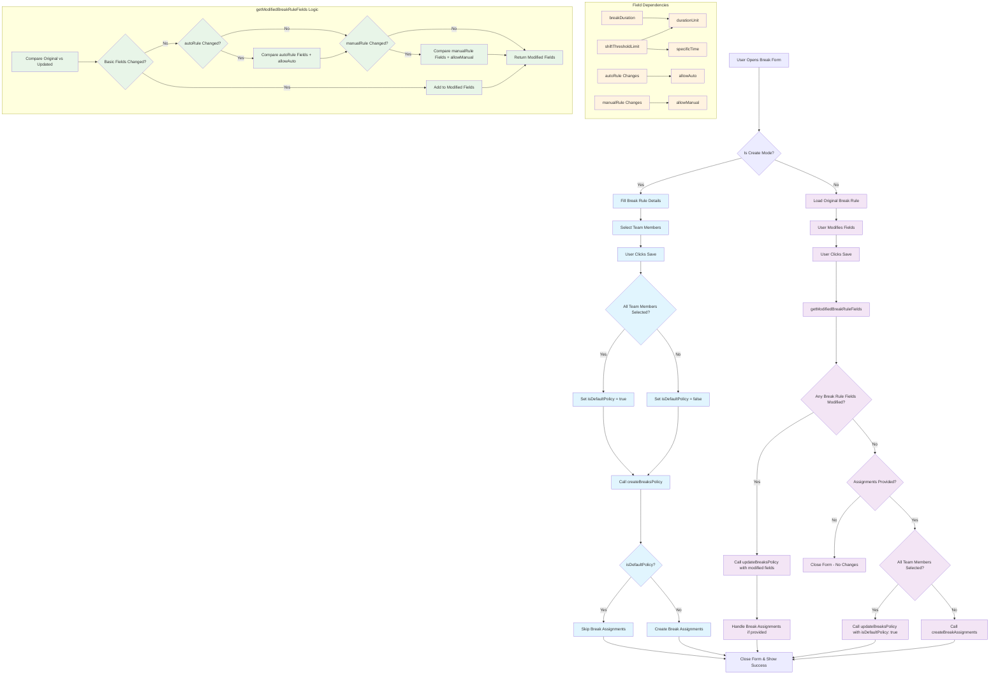

# Break Rules Create and Update Flow

## Key Features

- **Sparse Updates**: Only sends modified fields to reduce payload size
- **Dependency Handling**: Ensures related fields are updated together
- **Smart Assignment Logic**: Handles default policies vs individual assignments
- **Performance Optimization**: Avoids unnecessary API calls when no changes detected
- **Null/Undefined Equality**: Treats null and undefined as equal for comparison 