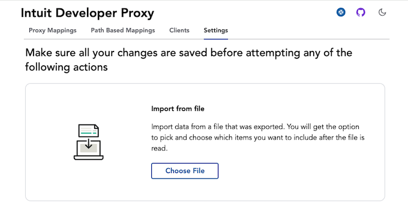
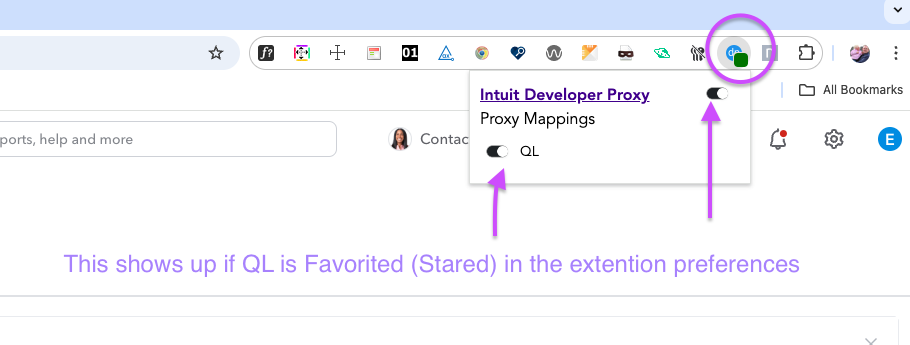

### Testing against Local Development Server with Intuit Developer Proxy

dev-proxy is a tool that allows you to test your app against a local development server. This is useful when you are
developing your app and want to test it against a local server running on your machine. While it is easy enough o update
the project to point to you local development server, testing with AuthZ enabled doesn't work as expected.  This is because
AuthZ no longer supports browserAuth + cookies.  Instead, it relies on the UI to hit the gateway which will convert
browserAuth to privateAuth+ and then forwards it to Quantum Leap.  However, for local, the gateway isn't involved.  Thus,
dev-proxy was born to help with this.

#### Installation
The project's installation instructions are fairly easy to follow
https://github.intuit.com/getdata/dev-proxy#installation

as part of the installation, you will need to install the Chrome extension.  You can find configuration for connecting to
Quantum Leap in the dev-proxy-config.json file which can be imported into the extension in settings. Download the file
[dev-proxy-config.json](assets/dev-proxy-config.json) and import it into the extension.



The configuration file includes the following settings:
- Proxy Mappings
- Path Based Mappings
- Clients *

Note, for the settings in clients, it includes the ApiKey which is the key found in config.json in the extendedProperties => AppSecret

#### Usage
After installing dev-proxy, as needed, you can start it by running the following command:
```
dev-proxy run
```

In your browser, login to QBO and then expand the Chrome extension to turn it on and ensure the QL proxy is selected.



Once these settings have been set, you can launch the QL UI, and it will hit your local dev server with 0 changes in the
UI or in the QL Service.
